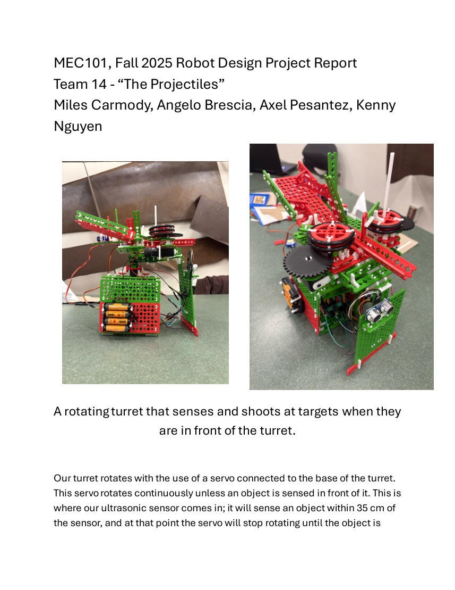
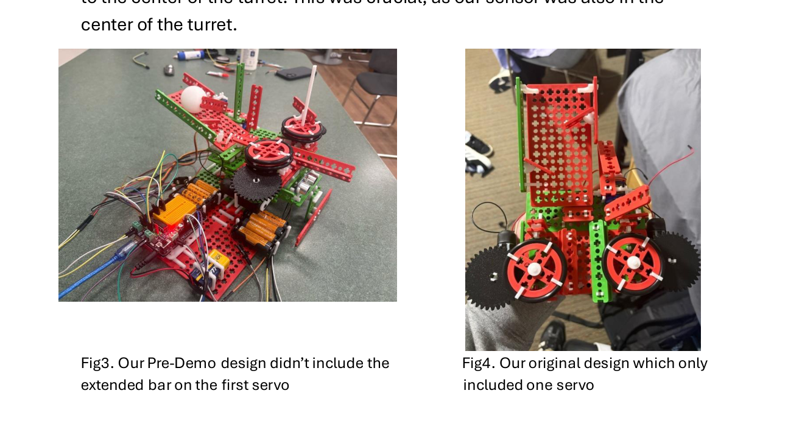

# Autonomous Targeting Turret

This project was developed for **MEC 101** as a four-person robot design project. The goal was to create a rotating turret capable of continuously scanning for targets, detecting an object with an ultrasonic sensor, stopping its rotation, loading a single projectile, firing, and then resuming its search for additional targets.

The turret uses an **Arduino Uno**, an ultrasonic sensor, servo motors, DC motors, a motor shield, and a custom mechanical firing system. While scanning, the turret rotates until an object is detected within approximately **35 cm**. Once a target is detected, the control logic stops the scanning motion and begins the loading and firing sequence.

## Project Demonstration

**▶ [WATCH THE AUTONOMOUS TURRET DEMONSTRATION](https://youtu.be/yytC-jThPk0)**

## Design Development

Fig.3 (left img.) is the Pre-Demo design did not include the only extended bar on the first servo.

Fig.4 is the original design, which included one servo

A major part of the project was redesigning the firing mechanism through repeated testing. The original launcher used two DC-motor-driven wheels, but the initial wheel speed was not high enough to produce useful launch performance. A **3:1 gear ratio** was introduced to increase rotational speed, and further mechanical changes were made to increase the force applied to the projectile and guide it more accurately through the center of the turret.

The reloading mechanism also went through multiple iterations. The first version used a single servo, but the mechanism could release more than one projectile because the servo did not recover quickly enough. The final design added a second servo and synchronized the two actuators in software so that only one projectile entered the firing chamber at a time.

The embedded control system coordinates the ultrasonic sensor, scanning servo, two loading servos, and dual DC motors. Distance is calculated from the ultrasonic sensor's pulse-return time, and the Arduino uses that measurement to switch between scanning and firing states. The final system was able to detect a target, complete the loading and firing sequence, and continue scanning for additional targets.

The project combined **mechanical design, prototyping, embedded programming, sensor integration, and iterative troubleshooting** into one working mechatronic system.

## Repository Contents

This repository includes the full project report, the Arduino control code, and selected images showing the completed robot and the evolution of the firing mechanism.

## Tools and Technologies

Arduino Uno · C/C++ · Ultrasonic Sensing · Servo Control · DC Motor Control · Motor Shield · 3D-Printed Gearing · Autodesk Inventor · TinkerCAD · Mechanical Prototyping
